**声明：主分支main是介绍项目；开发分支dev1是检测脚本；开发分支dev2是前端设计；开发分支dev3是后端设计**

## **项目介绍**

基于openkylin操作系统，实现linux的基线检查与poc漏洞扫描，并可扩展poc漏洞检测。

## 功能演示视频

链接：https://pan.baidu.com/s/16A5fnQ4lf2b1cu6LeWPGJQ?pwd=1234 
提取码：1234 

## 动态可视化渲染及资源云端化

本团队租了一台阿里云服务器用于传输数据和可视化展示，并且本团队项目中的所有资源全部云端化，包括MongoDB数据库、基线检测及漏洞修复结果、漏洞扫描及修复结果全部云端展示，动态化展示。

### **服务器网址**（第一次访问会比较慢一点，但是能正常访问）

服务器访问网址：http://152.136.142.183:8080/baseline

### **云端资源网址**

基线检查资源：http://152.136.142.183:39010/baseline

基线检查修复资源：http://152.136.142.183:39010/baselinerepair

系统漏洞扫描资源：http://152.136.142.183:39010/xbug

系统漏洞扫描修复资源：http://152.136.142.183:39010/xbugrepair

内核漏洞扫描资源：http://152.136.142.183:39010/nbug

内核漏洞扫描修复资源：http://152.136.142.183:39010/nbugrepair

### 云可视化关键页面（实时从数据库当中读取数据）

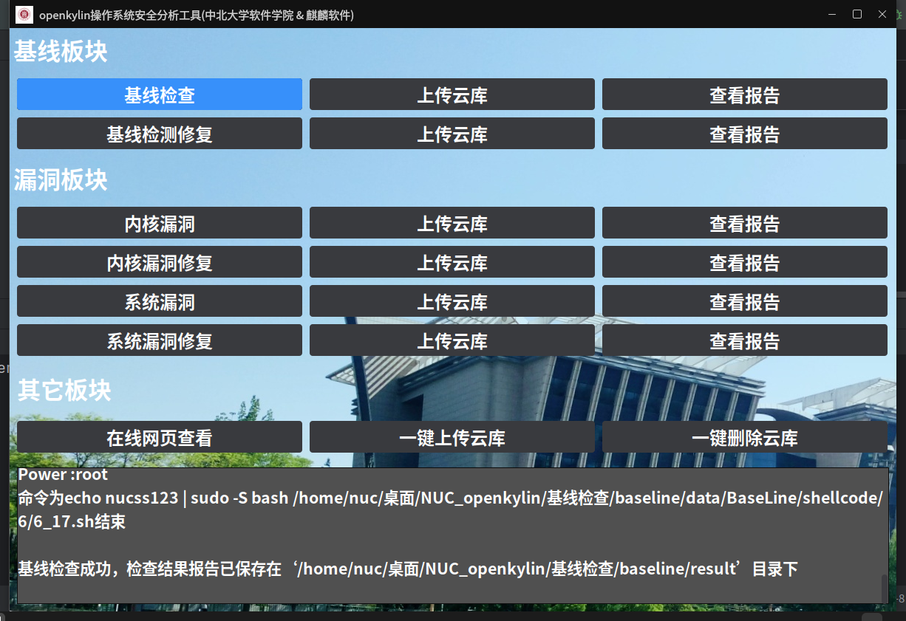

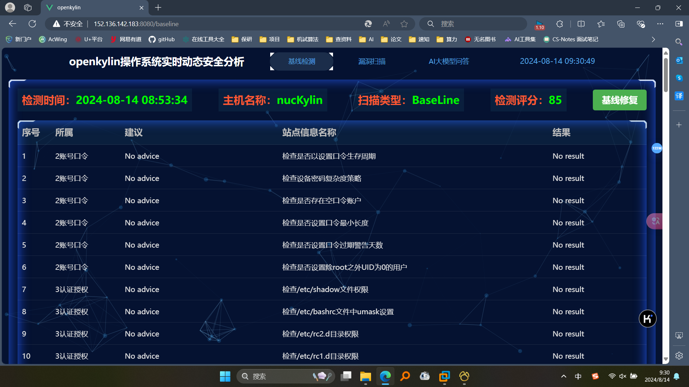

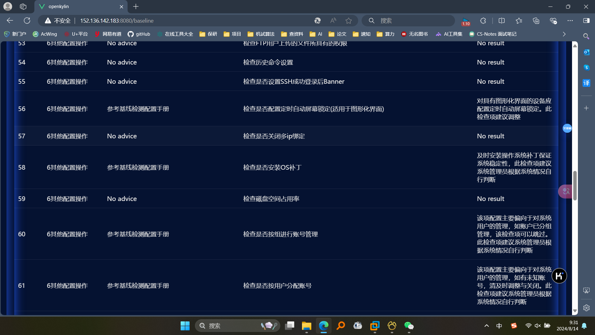

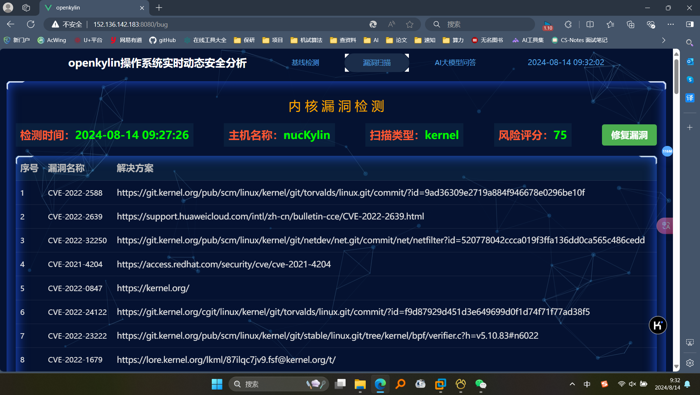

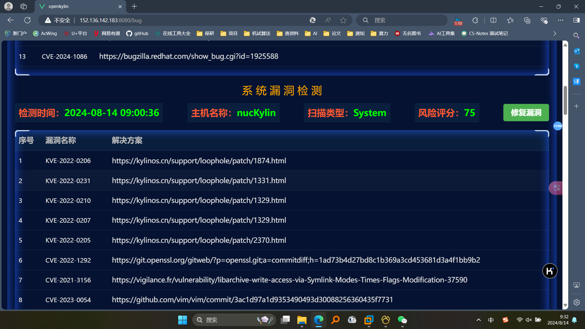


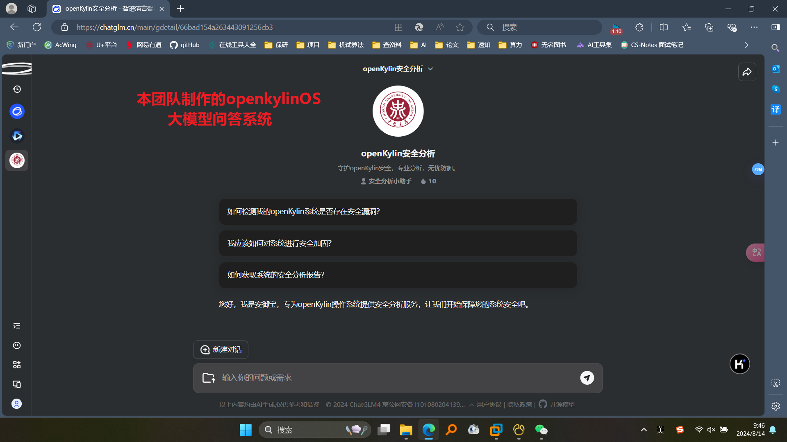

## 项目要求完成情况

#### 题目 1（完成全部内容）

```
功能一：实现系统安全配置基线检查，检查项覆盖操作系统通用安全需求(参考SCAP标准/等保安全配置基线标准) ，（已完成）

功能二：形成安全基线检查报告，需生成可视化报告，须支持pdf和rtf格式报告文档 。（已完成）

功能三：系统基线检查安全评估，制定系统基线安全评分标准，能够根据系统安全基线检查报告，结合SCAP标准/等保安全配置基线标准，进行系统安全评估，给出安全评分。（已完成）

功能四：实现系统总线服务接口自动化安全检查基线，要求针对操作系统中常见系统服务接口，能够实现自动化安全检查功能。（已完成）
```

#### 题目 2（完成全部内容）

```
功能一：实现安全漏洞（POC/EXP）检查功能	检查功能要求模块化，基于安全漏洞poc/exp检测。（已完成）

功能二：形成安全漏洞扫描报告，需生成可视化报告，须支持pdf和rtf格式报告文档 。（已完成）

功能三：系统安全漏洞评估，制定系统漏洞评分标准，能够根据系统安全漏洞数量及等级， 进行系统安全评估，给出安全评分。（已完成）

功能四：poc防逆向功能，采用加密、编译、身份认证、内存混淆等方式，对工具的敏感文件，如poc/exp等实施保护，防止敏感文件被恶意窃取。（已完成）
```

#### 本团队新增加功能（完成全部新增加内容）

```
功能一：可视化实时动态网页展示检测结果。（已完成）

功能二：基线检查、漏洞扫描的修复（已完成）

功能三：将对openkylin操作系统安全检测和AI大模型相结合，制作openkylin检测智能体。（已完成）

功能四：对任务的完成状况生成日志报告。（已完成）
```

#### 关键创新点

```
1、所有的检测结果以及数据库全部云端化，云服务器部署，全部支持公网IP访问；
2、项目巧妙将AI大模型与操作系统安全分析结合起来，实现“AI+”国家战略目标；
3、所有检测结果全部实现动态实时化智能检测。
```

## 比赛题目相关资料

### 版本信息

openkylin操作系统统一使用优麒麟22.04增强版：

### 下载路径如下

[unbuntukylin](https://www.ubuntukylin.com/downloads/)

`本次项目使用的虚拟环境ukylin（具体见项目文档目录）`

### 参考网址

- [genmai](https://gitee.com/openkylin/genmai)
- [LinEnum](https://github.com/rebootuser/LinEnum)
- [linuxprivchecker](https://github.com/sleventyeleven/linuxprivchecker)

### 题目分析

```
该题实际上涉及到了麒麟操作系统的各项服务，需要对linux命令，常见的安全基线标准，常见的漏洞有一定的了解，同时要使用到web编程或者图形化编程之类的知识去完成可视化报告的呈现，综合考察了学生对于操作系统底层原理，对于图形化界面设计的理解与应用。
```

**1.安全基线检查脚本**

    分析安全基线检查，并对应不同基线检查编写配置文件与shell脚本，脚本返回json数据报告并保存，系统通过对比返回数据与建议文档给出修复建议，前端读取json文件并美化进行显示，并且使用pdf和rtf格式形成报告文档。

**2.漏洞检测**

    流程与检查类似加入了poc相关漏洞文件并使用yaml进行配置，进行对poc的自动执行，并生成报告与漏洞修复。


## 系统框架设计

### 总体框架设计

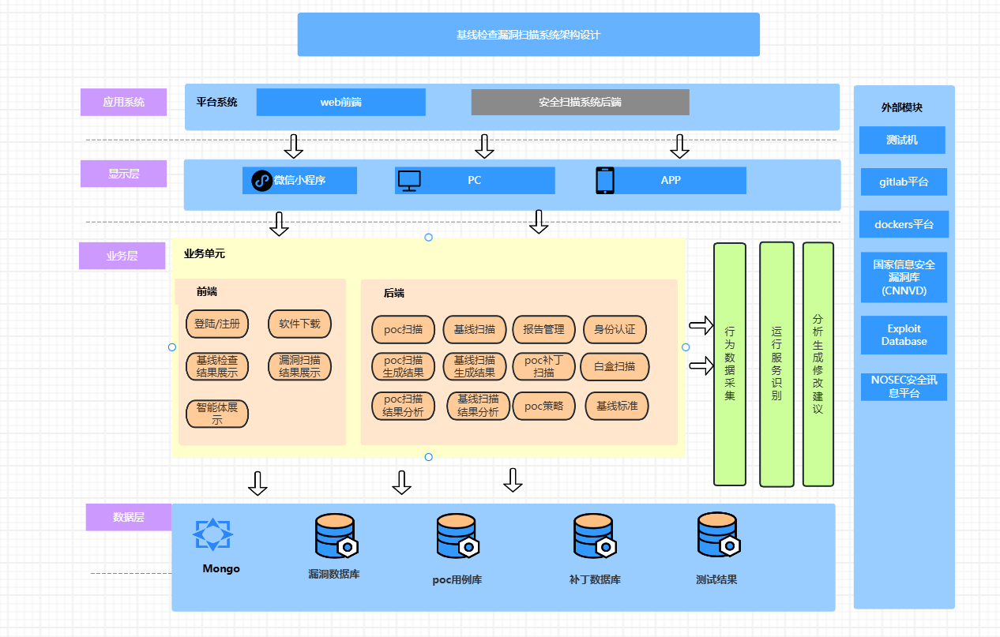

### 分层分模块架构图和流程图设计

#### 架构图设计1

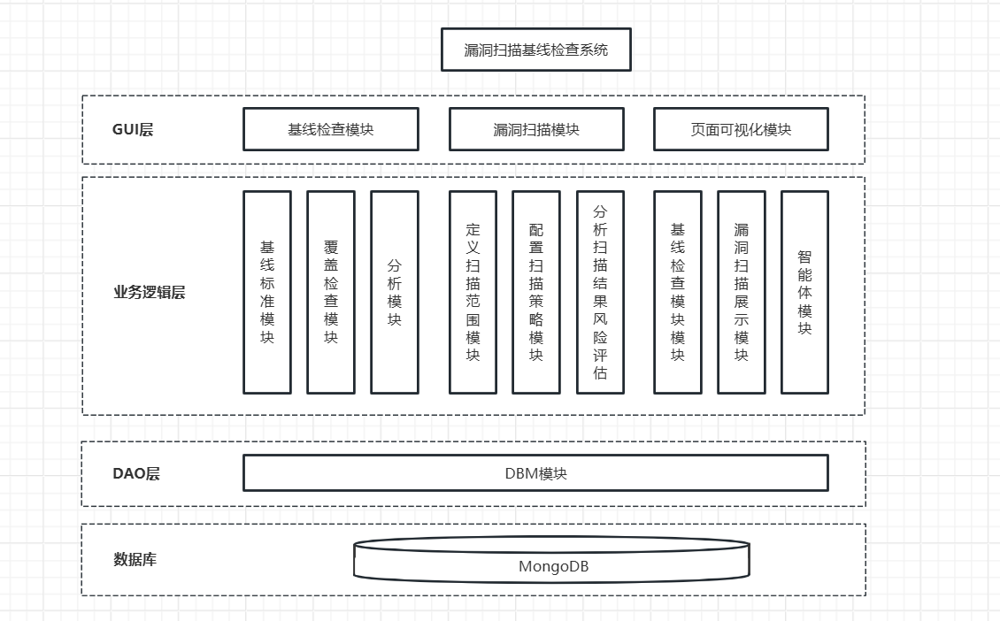

#### 架构图设计2

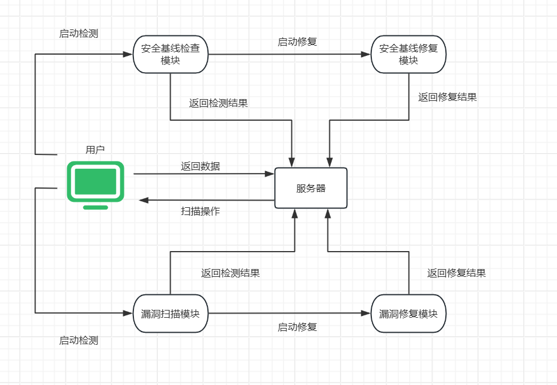

#### 流程图设计1

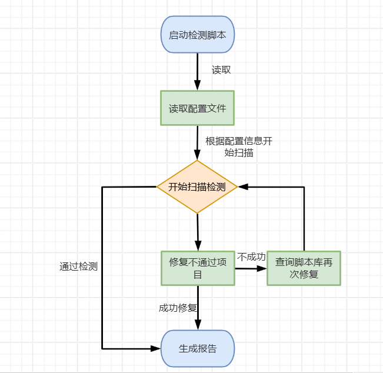

#### 流程图设计2

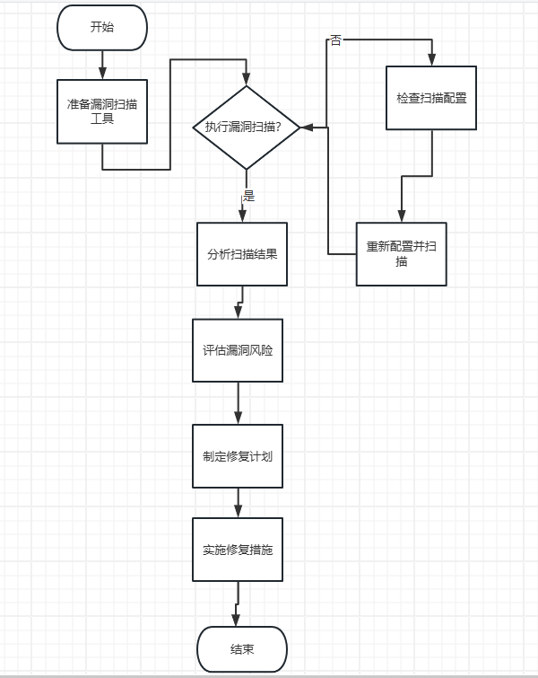

### 基线检测设计思路步骤

| 确定检测目标                                       | 选择基线标准                                                 | 制定检测清单                                         | 开发检测工具                                       | 测试和验证                                                 | 执行检测                                         | 报告和反馈                                                   | 整改和复检                                         |
| -------------------------------------------------- | ------------------------------------------------------------ | ---------------------------------------------------- | -------------------------------------------------- | ---------------------------------------------------------- | ------------------------------------------------ | ------------------------------------------------------------ | -------------------------------------------------- |
| 明确需要检测的系统、网络、应用程序或配置项。       | 选择适用的安全基线标准，如国家或行业标准、最佳实践、厂商推荐配置等。 | 根据基线标准，列出所有需要检查的安全配置项。         | 开发或选择现有的自动化工具来执行检测任务。         | 在安全的环境中测试检测工具，确保其准确性和可靠性。         | 在目标系统上执行检测工具，收集配置信息。         | 生成详细的检测报告，列出所有检测项的结果。                   | 根据报告中的建议，进行必要的配置整改。             |
| 确定检测的目的，如合规性、安全性增强、弱点评估等。 | 这些标准将作为检测的参考和依据。                             | 清单应详细，包括每个配置项的具体检查内容和预期标准。 | 工具应能够收集系统配置信息，并与基线标准进行比对。 | 验证工具的输出是否符合预期，能否正确识别不符合基线的配置。 | 分析工具生成的报告，识别不符合基线标准的配置项。 | 提供反馈给系统管理员或安全团队，指出不符合基线的配置和潜在的改善措施。 | 整改后，重新执行检测以验证系统是否达到了基线标准。 |

### 漏洞检测项目设计步骤

- `POC（Proof of Concept）`漏洞扫描是一种验证性的安全测试，它通过模拟攻击来证明漏洞的存在。

| 信息收集                                                     | 识别潜在漏洞                                                 | 选择POC                                                      | 测试环境准备                                         | 执行POC测试                                     | 分析结果                                    |
| ------------------------------------------------------------ | ------------------------------------------------------------ | ------------------------------------------------------------ | ---------------------------------------------------- | ----------------------------------------------- | ------------------------------------------- |
| 收集目标系统的信息，包括IP地址、域名、开放端口、服务版本等。 | 利用收集到的信息，通过工具如`Vulners、ExploitDB`等查找可能存在的漏洞。 | 本项目poc来源于`genmai`项目 POC可以是公开的漏洞利用工具，也可以是自己编写的脚本来验证特定漏洞。 | 在安全隔离的环境（如沙箱）中搭建目标系统的模拟环境。 | 在测试环境中运行`POC`工具或脚本，模拟攻击场景。 | 分析`POC`测试的结果，确定漏洞是否真实存在。 |
|                                                              | 关注安全社区和厂商发布的最新安全公告，获取最新的漏洞信息。   |                                                              | 确保测试不会影响到生产环境和其他系统。               | 观察系统的反应，记录测试结果。                  | 评估漏洞的严重性和可能的影响。              |

## 本项目使用的漏洞库

### 内核漏洞（一共选取24个常见漏洞）

- CVE-2021-2255：

> 漏洞描述：Linux 内核中 netfilter 子系统中的兼容 IPT_SO_SET_REPLACE/IP6T_SO_SET_REPLACE setsockopt 实现允许本地用户通过用户命名空间获得权限或导致拒绝服务（堆内存损坏）CVE-2016-3134 （CVSSv3 8.4 High） 和 CVE-2016-4997 （CVSSv3 7.8 High） 非常相似。

> 漏洞利用和验证：可以通过部分覆盖结构的指针并实现释放后使用来利用此漏洞。这足以在绕过KASLR，SMAP和SMEP的同时获得内核代码执行，`m_list->nextmsg_msg`。在本项目的漏洞利用程序通过pipe-primitive实现。在执行利用程序后检测id如果为uid=0(root)则证明该漏洞未被修补。

- CVE-2022-2588:

  > 漏洞描述:在Linux 内核的 `net/sched/cls_route.c` 实现的 `route4_change` 中发现了一个存在 `use-after-free` 缺陷漏洞，该漏洞源于释放后重用，本地攻击者利用该漏洞会导致系统崩溃，可能会造成本地特权升级问题。

  > 漏洞利用和验证:漏洞利用代码利用这两个双重释放功能来演示对任务凭据（即将推出的 kmalloc-192 双重释放）和打开文件凭据（利用 kmalloc-256 双重释放）的攻击。执行漏洞利用程序输出结果为success即为漏洞验证成功。

- CVE-2022-2639：

  > 漏洞描述：在 openvswitch 内核模块中发现整数强制错误。给定足够多的操作，在为新流的新操作复制和预留内存时，`reserve_sfa_size（）` 函数不会按预期返回 -EMSGSIZE，这可能会导致越界写入访问。此缺陷允许本地用户崩溃或可能提升其在系统上的权限。
  >
  > 漏洞利用和验证:执行漏洞利用程序后输入whoami，若结果为root表示系统中存在此漏洞。
  >
  > 漏洞修复原理：修复openvswitch中的`reserve_sfa_size（）`中的OOB访问给定足够多的操作，在复制和为新流的新操作保留内存，如果next_offset大于MAX_ACTIONS_BUFSIZE，函数 `reserve_sfa_size（）` 确实没有按预期返回 -EMSGSIZE，但它分配了`MAX_ACTIONS_BUFSIZE字节actions_len增加 req_size`。然后，这可能会导致OOB写入访问权限，尤其是在需要复制进一步操作时，通过重新排列流操作大小检查来修复它。

- CVE-2022-0847:

  > 漏洞描述：在 Linux 内核中的 `copy_page_to_iter_pipe 和push_pipe`函数中，新管道缓冲区结构的“flags”成员缺乏正确的初始化方式中发现了一个缺陷，因此可能包含过时的值。非特权本地用户可利用此缺陷写入由只读文件支持的页面缓存中的页面，从而提升其在系统上的权限。
  >
  > 漏洞利用和验证:使用Max Kellermann对Dirty Pipe的运用，但修改为覆盖`/etc/passwd中的root密码字段`，并在弹出根shell后恢复。即执行漏洞利用程序后，输入whoami结果为root

- CVE-2021-4204:

  > 漏洞描述：由于输入验证不正确，在Linux内核的eBPF中发现了越界（OOB）内存访问缺陷。此漏洞允许具有特殊权限的本地攻击者使系统崩溃或泄漏内部信息
  >
  > 漏洞利用和验证:v5.8 ≤ linux-kernel ≤ 5.16被影响，执行漏洞利用程序后输入whoami结果为root即为成功。

- CVE-2022-24122:

  > 漏洞描述：Linux kernel 5.14至5.16.4版本存在内存错误引用漏洞，该漏洞源于名称空间被禁用后，ucounts对象依然存在。当非权限用户的名称空间被启用时，攻击者可利用该漏洞提升权限。
  >
  > 漏洞利用和验证:v5.14-v5.16.4，当接受到输出[!] DESTROYED SHARED MEMORY后输入whoami结果为root即为成功

- CVE-2022-1679:

  > 漏洞描述： Linux kernel 存在安全漏洞，该漏洞源于在Athero无线适配器驱动程序发现了一个释放后重用缺陷，用户强制 ath9k_htc_wait_for_target 函数失败并显示一些输入消息。攻击者利用该漏洞提升系统上的权限。
  >
  > 漏洞利用和验证: Linux kernel 5.10版本被影响，执行检测程序得到"`>?:mitigation completed you are now save from CVE 2022-1679`"即为成功。

- CVE-2022-32250:

  > Linux kernel 5.18.1版本及之前版本存在安全漏洞，该漏洞源于`net/netfilter/nf_tables_api.c`允许本地用户将权限升级为root用户，攻击者利用该漏洞可导致释放后重用。
  >
  > 漏洞利用和验证:kernel(<=5.18.1s)，当利用程序被执行后输出I am root，输入whoami如果结果为root即为成功

- CVE-2022-23222:

  > 漏洞描述： 由于 Linux 内核的 BPF 验证器存在一个空指针漏洞，没有对 *_OR_NULL 指针类型进行限制，允许这些类型进行指针运算。攻击者可利用该漏洞在获得低权限的情况下，构造恶意数据执行空指针引用攻击，最终获取服务器 root 权限。
  >
  > 漏洞利用和验证:  kernel(>=5.8 && <=5.16)，当利用程序被执行后输出enjoy root，输入whoami如果结果为root即为成功

- CVE-2022-0185:

  > 漏洞描述： Linux kernel 存在输入验证错误漏洞，该漏洞源于在 `Linux kernel 的 Filesystem Context` 中的 legacy_parse_param 函数验证提供的参数长度的方式中发现了一个基于堆的缓冲区溢出缺陷。 非特权（在启用非特权用户命名空间的情况下，否则需要命名空间的 CAP_SYS_ADMIN 特权）本地用户能够打开不支持文件系统上下文 API 的文件系统（因此回退到遗留处理）可以使用此缺陷来提升他们在系统上的权限。
  >
  > 漏洞利用和验证:Linux kernel 5.1-rc1~5.16.2.当利用程序被执行后输入whoami如果结果为root即为成功。

- CVE-2021-26708:

  > 漏洞描述：Linux kernel 5.10.13之前版本存在本地权限提升漏洞。该漏洞源于`net/vmw_vsock/af_vsock.c`中的错误锁定导致AF_VSOCK实现中的多个竞争条件。目前没有详细的漏洞细节提供。
  >
  > 漏洞利用和验证:v5.5 ≤ linux-kernel ≤ 5.10.13，当利用程序被执行后输出waitting for sshd，输入id如果结果为`uid=0(root) gid=0(root) groups=0(root)`即为成功

### 系统漏洞（选取27个常见漏洞）

- CVE-2021-44142:

  > 漏洞描述：Samba官方发布安全公告，4.13.17之前的所有Samba 版本中存在一个代码执行漏洞（CVE-2021-44142），该漏洞存在于`Samba中vfs_fruit模块的默认配置中`，在smbd解析EA元数据时，对文件扩展属性具有写访问权限的远程攻击者（可以是guest或未认证用户）可越界写入并以root身份执行任意代码。
  >
  > 漏洞利用和验证: 4.13.x < Samba < 4.13.17、4.14.x < Samba < 4.14.12、4.15.x < Samba < 4.15.5，执行命令python3 CVE-2021-44142.py "127.0.0.1" "445" TimeMachineBackup root后结果为"successful"即为成功

- CVE-2021-3560:

  > 漏洞描述：Polkit（PolicyKit）是类Unix系统中一个应用程序级别的工具集，通过定义和审核权限规则，实现不同优先级进程间的通讯。pkexec是Polkit开源应用框架的一部分，可以使授权非特权用户根据定义的策略以特权用户的身份执行命令。发现polkit可能被欺骗，绕过D-Bus请求的凭据检查，将请求者的权限提升到root用户。
  >
  > 漏洞利用和验证:0.105 ≥ policykit ≥ 0.113，执行命令python3 CVE-2021-3560.py后等待输出"`bash: no job control in this shell"输入whoami`，结果为root时成功

- CVE-2021-4034:

  > 漏洞描述：polkit pkexec 中对命令行参数处理有误，导致参数注入，能够导致本地提权。pkexec应用程序为Linux系统预装工具，攻击者可通过构造特定的参数诱导pkexec执行任意代码，从而获取本地管理员权限。
  > ScopeOfInfluence:

- CVE-2021-3156：

  > 漏洞描述： Sudo 是一个用于类 Unix 计算机操作系统的程序，它能够使用户能够以另一个用户（默认是超级用户）的安全权限运行程序。sudoedit 功能用于以另外一个用户身份编辑文件。Sudo before 1.9.5p2 存在缓冲区错误漏洞，攻击者可使用sudoedit -s和一个以单个反斜杠字符结束的命令行参数升级到root。
  >
  > 漏洞利用和验证: 小于1.9.5p2，执行命令 CVE-2021-3156.sh后输出 `"sudoedit; /: not a regular file"`即为成功

- CVE-2022-0543：

  > 漏洞描述：Debian 以及 Ubuntu 发行版的源在打包 Redis 时，不慎在 Lua 沙箱中遗留了一个对象package，攻击者可以利用这个对象提供的方法加载动态链接库 liblua 里的函数，进而逃逸沙箱执行任意命令。我们借助 Lua 沙箱中遗留的变量package的loadlib函数来加载动态链接库`/usr/lib/x86_64-linux-gnu/liblua5.1.so.0`里的导出函数luaopen_io。在 Lua 中执行这个导出函数，即可获得io库，再使用其执行命令。
  >
  > 漏洞利用和验证:2.2 <= redis < 5.0.13，执行命令`python3 CVE-2022-0543.py后输入whoami`，结果为root时成功

- CVE-2021-41773：

  > 漏洞描述：Apache 披露了一个在 Apache HTTP Server 2.4.49 上引入的漏洞，称为 CVE-2021-41773。同时发布了2.4.50更新，修复了这个漏洞。该漏洞允许攻击者绕过路径遍历保护，使用编码并读取网络服务器文件系统上的任意文件。运行此版本 Apache 的 Linux 和 Windows 服务器都受到影响。此漏洞是在 2.4.49 中引入的，该补丁旨在提高 URL 验证的性能。可以通过对“.”进行编码来绕过新的验证方法。如果 Apache 网络服务器配置未设置为“要求全部拒绝”，则漏洞利用相对简单。通过对这些字符进行编码并使用有效负载修改 URL，可以实现经典的路径遍历。
  >
  > 漏洞利用和验证: Apache HTTP = 2.4.49，执行命令`python3 CVE-2021-41773.py "127.0.0.1"`后输出”Server 127.0.0.1 IS VULNERABLE“时成功


## 开发计划

### 功能分析，基线了解（3月10日—3月20日）

#### 3月10日

**一、需求分析**

| 业务流程                                       | 法律法规和标准调研                                           | 现有安全措施评估                                             |                      安全需求和目标确定                      |
| ---------------------------------------------- | ------------------------------------------------------------ | ------------------------------------------------------------ | :----------------------------------------------------------: |
| 识别关键业务系统和数据，确定其安全防护的优先级 | 研究国家相关法律法规，如《网络安全法》、《信息安全技术 信息系统安全等级保护基本要求》等。 考虑行业特定的安全标准和最佳实践。 | 评估现有的安全措施，如防火墙、入侵检测系统、安全审计等。 分析现有措施的有效性和覆盖范围。 | 根据调研结果，确定信息系统的安全需求。 设定安全防护的目标，如合规性、业务连续性、数据保护等。 |

**二、制定检查项**

| 操作系统基线                                                 | 网络设备基线                                                 | 数据库基线                                                   | 应用程序基线                                                 | 桌面和终端安全                                               |
| ------------------------------------------------------------ | ------------------------------------------------------------ | ------------------------------------------------------------ | ------------------------------------------------------------ | ------------------------------------------------------------ |
| 账户策略：密码复杂度、密码期限、账户锁定策略等。 -访问控制：文件权限、注册表权限、服务权限等。 -安全选项：如网络安全的设置、系统更新的配置等。 -审核策略：确保启用必要的审核功能。 | 设备配置：如密码策略、登录尝试限制、SSH配置等。 -接口配置：VLAN配置、端口安全、风暴控制等。 -路由和防火墙规则：确保规则符合安全政策。 | 账户管理：密码策略、权限分配等。 -配置安全：如数据库审计、加密、备份等。 -数据库对象安全：表、视图、存储过程的权限设置。 | Web应用安全：如跨站脚本（XSS）、SQL注入防护等。 -应用程序权限：确保应用程序权限符合最小权限原则。 -编码安全：确保代码中没有安全漏洞，如缓冲区溢出等 | 防病毒和反恶意软件：确保终端有最新的防护软件。 -操作系统更新：确保终端操作系统定期更新。 -应用程序控制：限制安装和运行不必要的应用程序。 |

#### 3月13日

| 设计YAML配置文件格式                                         | 编写Python主程序                                             |
| ------------------------------------------------------------ | ------------------------------------------------------------ |
| 完成单个项目配置文件、总体配置文件和检查结果文件的YAML格式设计。 确保YAML文件包含必要的信息，如检查项、预期结果、实际结果等。 | 实现YAML配置文件的读取功能。 编写测试用例，验证YAML文件读取功能的正确性。 确保读取的配置信息符合预期格式。 |

#### 3月15日

- **完成总体检查配置文件设计：**
  - 根据项目需求，设计总体配置文件的YAML格式。
  - 确保总体配置文件包含所有必要的配置信息，如检查项、检查顺序等。

#### 3月17日-3月20日

| 约定检查程序文件目录结构：                                   | 编写Python测试脚本                                           | 完善页面样式设计                                             |
| ------------------------------------------------------------ | ------------------------------------------------------------ | ------------------------------------------------------------ |
| 设计文件目录结构，确保所有相关文件（配置文件、脚本、结果文件等）有明确的存放位置。 编写文档，描述文件目录结构及其使用方法。 | 编写`read_yaml`函数，实现读取YAML配置文件的功能。 编写`initialize_yaml_data`函数，实现初始化结果文件的功能。 编写`write_yaml`函数，实现将检查结果写入YAML文件的功能。 编写`print_pro_info`函数，实现测试打印项目信息的功能。 编写测试用例，验证测试脚本的功能正确性。 | 设计页面布局和样式，确保页面清晰易读。 确保页面样式符合项目整体风格。 |

### 编写sh脚本（3月21日-4月20日）

#### 3月21日-4月1日

- **第二章检查配置文件和脚本**：编写与基线检查相关的配置文件和脚本，以及相应的基线检查手册。
- **完善页面功能的需求分析**：分析页面所需的功能，包括接收和存储JSON数据，展示历史检查记录和单次检查报告。
- **页面功能分配**：设计四个页面，分别是历史安全基线检查报告页面、历史安全漏洞检查报告页面、单次安全基线检查报告页面和单次安全漏洞检查报告页面。

#### 4月1日-4月10日

- **第三章检查配置文件和脚本**：编写与内核和系统安全漏洞检查相关的配置文件和脚本，以及相应的基线检查手册。
- **数据库设计**：设计多个数据库表，用于存储安全基线扫描记录、内核安全漏洞扫描记录、系统安全漏洞扫描记录等。

#### 4月10日-4月20日

- **第四章检查配置文件和脚本**：编写与页面路由和视图函数相关的配置文件和脚本，以及相应的基线检查手册。
- **测试**：通过HTTP接口接收JSON数据，并将数据存入数据库中。对各个页面进行逐一测试，确保它们的功能正确无误。

### 完善脚本配置，编写中期报告（4月21日—5月1日）

- **编写剩余检查配置文件、脚本和手册：**
  - 根据项目需求，编写第五章的检查配置文件、脚本和手册。
  - 确保配置文件、脚本和手册包含所有必要的检查项和相关信息。
- **整理项目文件：**
  - 整理所有项目相关文件，包括配置文件、脚本、手册等。
  - 确保文件结构清晰，方便后续使用和维护。
- **编写使用报告：**
  - 编写项目使用报告，描述项目的功能、使用方法、注意事项等。
  - 确保报告内容准确、详细，方便用户了解和使用项目。

### 了解并开发POC漏洞检测以及漏洞修复（5月1日-5月30日）

| 了解并开发POC漏洞检测                                        | 测试程序功能                                                 |
| ------------------------------------------------------------ | ------------------------------------------------------------ |
| 学习和研究POC漏洞检测的原理和方法。 根据项目需求，开发POC漏洞检测功能。 结合漏洞测试模块和可视化报告模块，实现漏洞检测和报告展示功能。 测试程序功能 | 编写测试用例，验证漏洞检测功能的正确性。 确保漏洞检测功能能够准确识别和报告漏洞 |

### 完成可视化（5月31日—7月15日）

| 实现漏洞修复功能                                             | 测试各接口和功能调用                                         | 整理项目文件                                                 | 编写项目报告及使用说明                                       |
| ------------------------------------------------------------ | ------------------------------------------------------------ | ------------------------------------------------------------ | ------------------------------------------------------------ |
| 根据项目需求，设计漏洞修复功能的实现方案。 编写漏洞修复功能的代码，实现自动或半自动的漏洞修复。 编写测试用例，验证漏洞修复功能的正确性。 | 编写测试用例，验证各接口和功能调用的正确性。 确保接口和功能调用能够满足项目需求。 | 整理所有项目相关文件，包括代码、配置文件、手册等。 确保文件结构清晰，方便后续使用和维护。 | 编写项目报告，描述项目的功能、实现方法、测试结果等。 编写使用说明，描述项目的安装、配置、使用方法等。 |

### 进一步完善动态实时可视化以及更新漏洞库（7月16日—8月14日）


## 比赛过程中的重要进展（大概有20会议，下面是节选部分）

### 5.05 开第一次会议

    讨论选择题目和分工，根据队伍里各个队友的所学知识和偏好，最终选择了麒麟操作系统安全基线检查这一题目，并确定了组内各个成员的分工情况，将题目的要求分为三个部分，第一个部分是安全基线检查脚本的撰写，第二个部分是漏洞检查脚本的撰写，第三个部分是前两个部分检查结果的可视化平台编写。各个部分间通过HTTP请求进行通信，有效地将系统各个部分解耦合，加快了开发速度

### 5.14 开第二次会议

    讨论各部分项目进度，交流各部分项目遇到的问题和解决方案。在漏洞检测和安全基线检查方面，主要是检查脚本数据库的建立和编写，由于存在大量的检查项都需要编写对应的脚本，所以需要认真规划编写计划，同时要注意实时编写对应文档和注释，方便后期维护。在可视化方面，参考市面上的安全检查项目页面，讨论安全检查项目的页面构成。

- 5.15 漏洞检测内核模块完成

- 5.16 搭建好安全基线检查项目的框架，大概由三部分配置文件，检查项目数据库，检查控制主程序构成。

- 5.25 漏洞检测系统模块完成

- 5.25 完成安全基线检查数据库的数据填充。并测试好数据库所有内容都可正常显示和运行。

### 5.26 开第三次会议

    总结统计了目前项目的进度，代码编写工作基本完成，指出了下一阶段的重点方向在于合并三个模块，同时编写测试和开发文档。

### 6.15进决赛了开第四次会议

### 7.15进决赛之后的第五次会议（制定国赛第一阶段要完善的任务）

### 7.30国赛第一阶段作品提交第六次会议

### 8.10总决赛要怎么答辩以及完善作品第七次会议

### 8.12总决赛第八次会议

### 8.14总决赛第九次会议

## 结果展示

### 基线模块

​	可以看出该脚本运行正常时将输出检测项目的信息，运行的命令和运行情况，最终将输出单个检查的结果信息，使得用户更加了解运行过程。

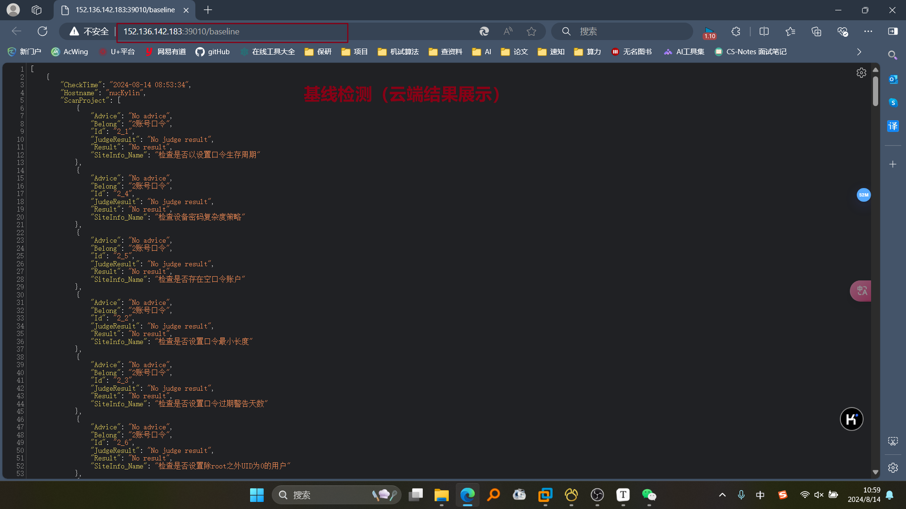

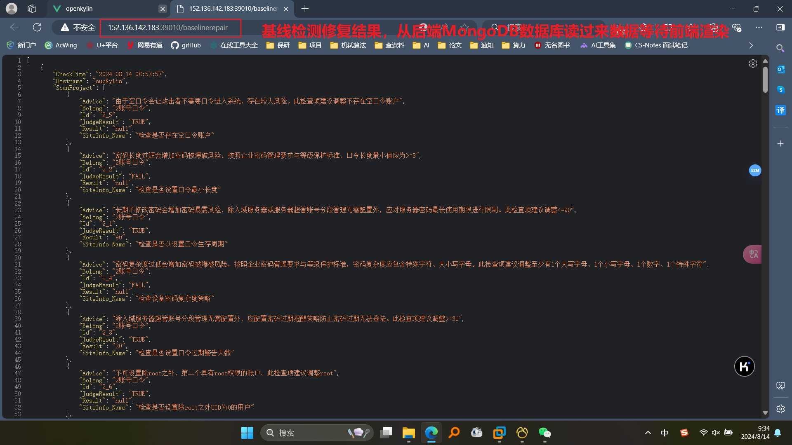

### 漏洞检测模块

#### 内核漏洞

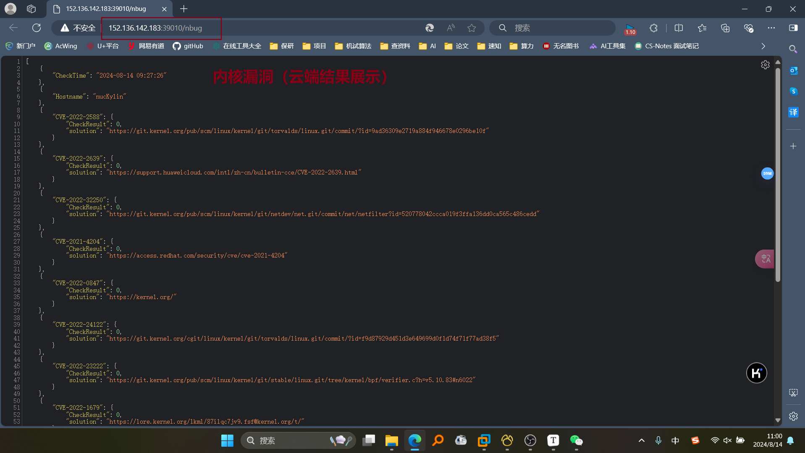

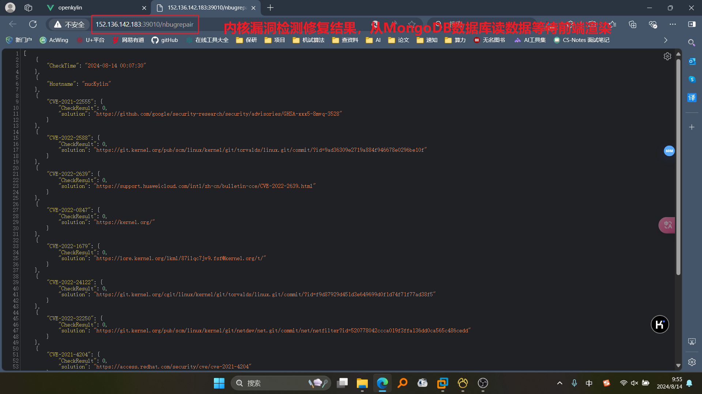

#### 系统漏洞

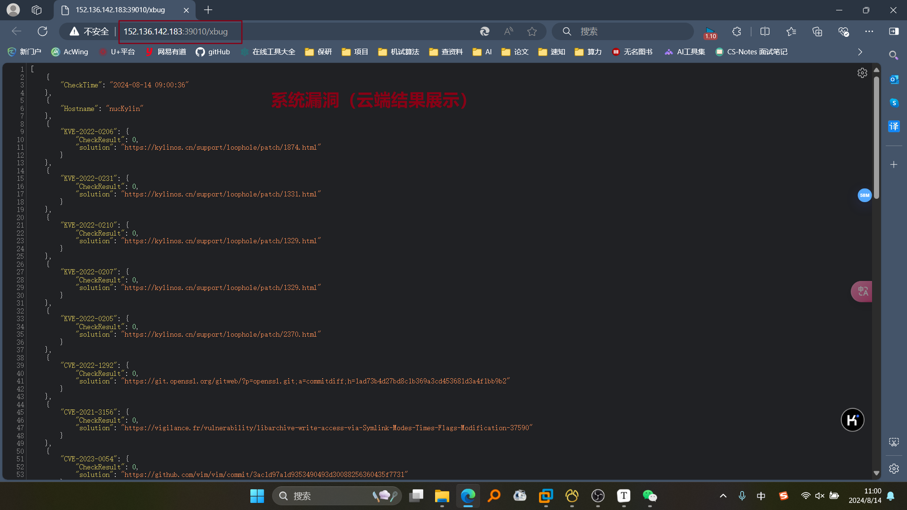

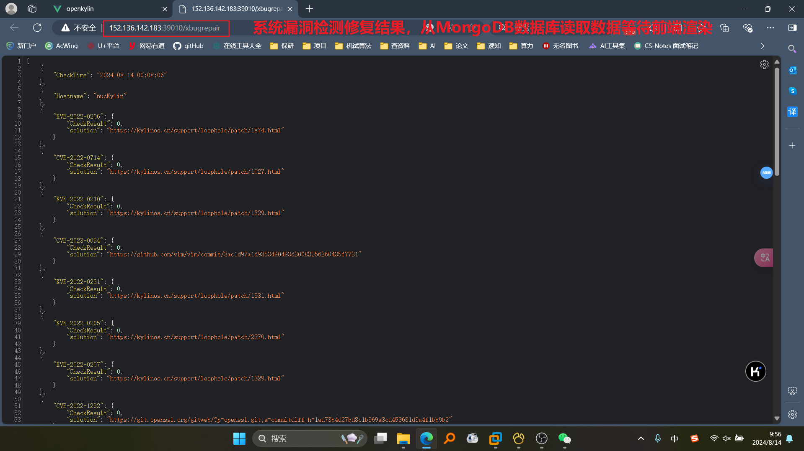

## 遇到的主要问题和解决方法

1. **专业知识储备不足**：基线检查需要深入了解网络安全、操作系统安全、应用程序安全等方面的知识。花费了大量时间来学习这些知识。
2. **跨平台兼容性**：没有足够的跨平台知识，需要了解不同Linux版本的大致不同，与修改项是否影响功能。
3. **不遗漏重要的安全基线检查项**：参考了等保安全基线，SCAP安全基线、开源安全基线检查项目和企业安全基线检查的标准，根据重要的必须检查，一般的尽量检查。
4. **检测项目众多**：合理高效编辑代码是一个非常重要的问题。找到了一些网上的开源项目，只需要配置文件就可以直接使用。
5. **性能和资源消耗**：漏洞检测可能会消耗大量的计算资源。有些漏洞在失败时会反复执行大大消耗资源和时间，有时还会使虚拟机崩溃。在shell中加入时间限制，失败就跳过该检测，不重复消耗资源
6. **误报和漏报**：检测工具可能会产生误报或漏报。对同一项目进行多次修复。

## 比赛收获

```
## 比赛收获

1.通过本次比赛，增强了团队合作和开发的能力，能够合理分解任务，将一个大的项目分成几个子项目交给各个成员负责

2.增强了软件设计与开发的能力，对于一个操作系统的完整功能实现，合理、高效、低耦合的系统架构有利于提高项目开发的效率，同时使得后期项目整体运行时不容易出现兼容性之类的冲突，增强了系统的健壮性

3.学习了麒麟操作系统和linux操作系统的底层知识，对于操作系统的运行过程及其底层原理，可以从安全性的视角来看待操作系统存在的问题，分析用户使用时可能出现的风险。

4.熟悉了搭建Django项目的基本思路及流程，对于URLConf有了更深的了解，实现Django项目中使用http接口完成了检测数据的传输。

5.了解了yaml数据与json数据的格式规范，对比yaml与json在网络通信中的不同之处，综合分析，使用了json进行本系统的网络通信。

```

